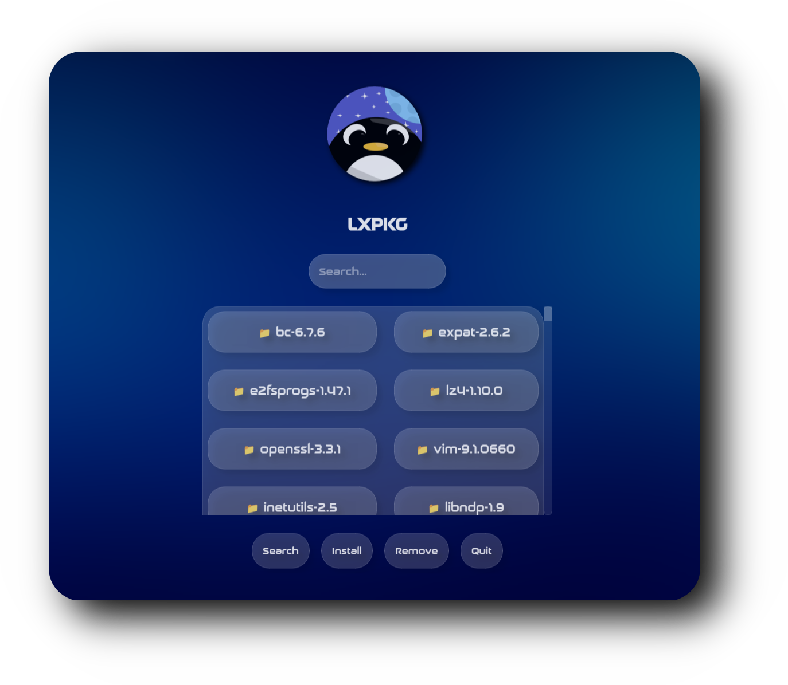

      
# 𝗟𝗫𝗣𝗞𝗚
### The independent GUI Package Manager for LearnixOS Gnu/Linux

<h1>
      

 

## ⚙️ 𝙁𝙚𝙖𝙩𝙪𝙧𝙚𝙨

  -  𝗗𝗲𝘃𝗲𝗹𝗼𝗽𝗲𝗱 𝗳𝗿𝗼𝗺 𝗦𝗰𝗿𝗮𝘁𝗰𝗵 ⚙️
  -  𝗪𝗿𝗶𝘁𝘁𝗲𝗻 𝗶𝗻 𝗣𝘆𝘁𝗵𝗼𝗻 🐍
  -  𝗟𝗶𝗴𝗵𝘁𝘄𝗲𝗶𝗴𝗵𝘁 𝗮𝗻𝗱 𝗙𝗮𝘀𝘁 ⚡
  -  𝗦𝗲𝗮𝗿𝗰𝗵 𝗮𝗻𝗱 𝗗𝗶𝘀𝗰𝗼𝘃𝗲𝗿 𝗣𝗮𝗰𝗸𝗮𝗴𝗲𝘀 🔍
  -  𝗨𝗽𝗱𝗮𝘁𝗲 𝗮𝗻𝗱 𝗥𝗲𝗺𝗼𝘃𝗲 𝗣𝗮𝗰𝗸𝗮𝗴𝗲𝘀 🔄
  -  𝗖𝘂𝘀𝘁𝗼𝗺 𝗥𝗲𝗽𝗼𝘀𝗶𝘁𝗼𝗿𝘆 𝗦𝘂𝗽𝗽𝗼𝗿𝘁 🗃️

### ‎ STILL EARLY IN DEVELOPMENT!
###### 𝗗𝗼𝗻'𝘁 𝘁𝗿𝘆 𝘁𝗵𝗶𝘀 𝗼𝗻 𝗮 𝗽𝗿𝗼𝗱𝘂𝗰𝘁𝗶𝗼𝗻 𝗺𝗮𝗰𝗵𝗶𝗻𝗲 𝘆𝗲𝘁
